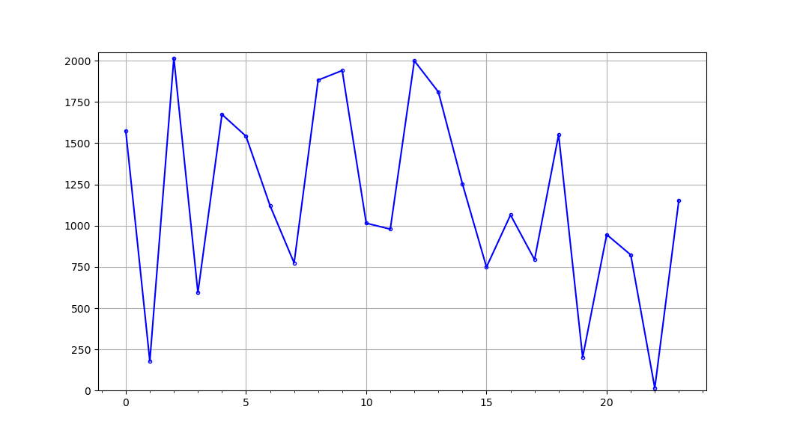

# Obfuskey

A cryptocurrency wallet seedphrase reversible, offline, trustless, password based obfuscation to end the paper-seedphrase nonsense.

or mapping finite sets with infinite sets

***

## Summary
1. Background
2. Obfuscation
3. Offset calculation
    1. Algorithm
    2. theoretical limitations
    3. Practical experiments
4. Security

***

## 1. Background

*Before going deeper into the "hows", let's quickly go through the "whys".*  
  
Using cryptocurrencies - *which could be summed-up as a very technologically advanced way of managing one's funds* - it felt really stupid to have to rely on a piece of paper to safely store the only way to recover a wallet, i.e. the seedphrase. It feels paradoxical that the only way to safely store it is on a piece of paper which can be:
    - found by anybody else than you, meaning loss of control over your wallet
    - damaged/destroyed by environmental events (would it be fire, water, earthquake ...?)
You can of course try to mitigate the second point by using a different media than paper, some might even use metal, but it doesn't help with the first point: if anyone else than you finds your media, they get your keys, your cryptos.

Lets quickly state here that I am aware of the existence of passphrase-protected seedphrases but this doesn't solve the problem since you still should never have your seedphrase exposed to the world even if it is protected by a passphrase.

You can of course opt for a digital storage, which is a terrible idea for the following reasons:
  
1. Accessibility
If it is digital, it can be remotely:
    - opened without leaving a trace
    - copied without leaving a trace
    - modified
    - deleted
You can mitigate the first 3 by password protecting it but it won't help you if it is deleted. Also, if it is locally password-protected, it can be brute-forced. If it is remotely password protected (using 2FA and such) you can always get hacked/sim-swapped etc.
  
2. Digitality
Because it is under the digital form, if anything happens you can't have a physical copy of it. You can't print a password-protected zip. I mean, you could print out every byte of the file but typing it back will be quite something. And if you print it out as plain text you are back to square one with a piece of paper that anyone can find and can be destroyed.
  
3. Storage
If you rely on a text file inside of a zip file stored on a cloud service, you have to trust the cloud service to be there for ever and never lose your file. This should be seen as a third-party trust-based storage.
  
4. Security
Trying to break a password encryption is only a matter of computing power and can be performed fully offline. If the password is not found in usual password-listings, the attacker would have to run all possible character combinations. While it is not fast, the attacker will know they have broken the encryption because the text will be readable/the hash will match.
  
The main take-out is that to be perfectly safe you would need to have it both on a physical media AND under a digital form BUT without having to rely on any third party for the storage and protection of the file WHILE keeping the physical copy not readable.

The obvious solution to this problem is obfuscation for the following reasons:
- once obfuscated, it is useless unless you have the way to desobfuscate it so you can keep it digitally
- because it is an obfuscation within the mnemonic, it is still under the form of a seedphrase so it is easy to type, easy to print out so you can keep it physically
- but because it is under the form of a mnemonic phrase, it also means you can't just brute-force it back because you won't know if you successfuly broke it. This will get clearer further down the document.
- if you use a passphrase-protected seedphrase, obfuscating your seedphrase makes it theoretically impossible to break without the password(s)
  
## 2. Obfuscation

Before going forward, let's define some words:
    - Seedphrase: a list of words in a specific order which grants access to a wallet
    - Mnemonic: the listing of all possible words used to create the seedphrase. By default we will be talking about BIP39-english which contains 2048 unique words.
    - Index: Usually the position of an item in a list. Because the words in a seedphrase are taken from the mnemonic, every word has a unique index in the mnemonic meaning every word can be seen as an index in the mnemonic. Therefore:
```python
"test test test test" == [1789, 1789, 1789, 1789]
```
1789 being the index of the word "test" in the BIP39-english mnemonic.
    - Offset: considering a seedphrase and its obfuscated version, the offset is the numerical distance between the indexes at the same position in the two seedphrases.
    - The shape of a seedphrase: This can be seen as the fingerprint of your seedphrase. Since your seedphrase is not a list of words but actually a list of indexes, it can be plotted in a 2D space with the index in the list as x-axis and the index of the word in the mnemonic as the y-axis.

    - seedphrase word-gap: the distance between consecutive indexes within the mnemonic. For example, considering the phrase:
```python
phrase = ['test', 'test']
phrase == [1789, 1789]
```
    the word-gap is 0.

With this obfuscation, we simply re-index every word of the seedphrase into the mnemonic without keeping its original shape (non conservation of word-gaps) by using one or more - but preferably more - password(s). The output is a completely new seedphrase that has no other link to your original seedphrase than the passwords you have set and can only be retrieved by desobfuscating it using this same obfuscation algorithm in reverse.


## 3. Offsets calculation

The core of this obfuscation is the offsets calculation algorithm. The offsets are calculated based on the characters in the password used to protect the seedphrase.

### 1. Algorithm

In order to calculate our offsets we are basically using only one function. This function being recursive and with variable parameters, having one of the values doesn't give us any clue about the other offset values which means we can safely give ourselves some hints on the password to help us retrieving it without giving away more info than the one we decide to.

Let's already clear things up a little bit. Considering the seedphrase is simply a human-machine interface to make it easier to retrieve your wallet than typing all the bytes or hexadecimal (which is error prone) type the The password is only a human-machine interface used to help us remember our key to the obfuscation. The password should actually be seen as an array of unique numbers which are the Unicode code-point of the letters composing the password. Therefore, a password "abcdefg" should be interpreted as:
```python
[ord(a), ord(b), ord(c), ord(d), ord(e), ord(f), ord(g)]
```
For readability we will consider the array "pwd":
```python
pwd = [a,b,c,d,e,f,g]
```
Where a,b,c,d,e,f,g are integers.

So, in order to obfuscate, we first calculate a global password value as follow:
```python
offset = 1
for element in pwd:
    offset = element * (offset + 1)
```

Once the offset is set as a large number based on every characters of the password, we run again this algorithm but now saving each of the offset into an array the length of our seedphrase (one offset per word in the seedphrase) initialized to 0:
```python
offsetList = [] 
for i in range(seedphrase_length):
    offsetList.append(0)
for i in range(len(pwd)):
    offset = pwd[i] * (offset + 1)
    offsetList[i%seedphrase_length] = offsetList[i%seedphrase_length] + offset%prime_divisor    #We are overflowing if the password is longer than the seedphrase
```
where prime\_divisor is the first prime number bigger than our mnemonic size.

This way, we are generating a different offset even if the character is the same and the outcome is seemingly random.


### 2. Theoretical limitations

Because we are accepting any Unicode input as a password (technically an infinity of input since we don't limit the password length and there are 1114112 unicode code points per today) to generate a list of words (12, 24 maybe words) from the mnemonic (a finite set of 2048 possible words), we are mapping something very small with something very large. Because we cannot have output outside of the mnemonic set or null/zero outputs, this obviously means we will have more than one password generating the same list of offsets, therefore the same list of words. Before adding the overflow (v1.0) these duplicates were very common and defined as follow:
Given two passwords A and B of different lengths, if:
```python
 A.offset == B.offset mod prime\_divisor
```
and 
```python
A[0..12] == B[0..12]
```
then
```python
A.offsetList == B.offsetList
```

This was addressed by adding the overflow meaning if the password is longer than the seedphrase we continue to calculate offsets and adding them to the value in the position we are in the list (v2.0).

With this v2.0 we now have a lot less duplicates as you will see below in the practical examples.

While the fact that we have more than one password for one set of offsets can be seen as a bug, I prefer to see it as a feature. In the same way this clearly means that another password than the one you have set will desobfuscate your seedphrase, it also renders the attack on your obfuscated seedphrase more difficult. Anyone trying to break your password would either have to test multiple times the same seedphrase they got with a different password or keep track of the billions of seedphrase they got already (because they would face a wall of duplicates) which would slow down significantly the process. You should basically see it as "not only one password will unlock my seedphrase BUT potentially every seedphrase they will get by brute-forcing it will be a duplicate of another seedphrase already". The biggest safety-argument of this obfuscation is to make it so absurdly difficult that no one will even try.

### 3.
