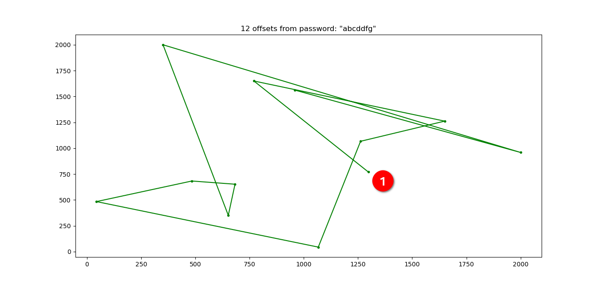

# Obfuskey

A cryptocurrency wallet seedphrase reversible, offline, trustless, password based obfuscation to end the paper-seedphrase nonsense.

***

## Summary
1. Background
    1. Why?
    2. BIP39 and security
2. Obfuscation
3. Offset calculation
    1. Algorithm
    2. theoretical limitations
    3. Practical experiments
4. Security
    1. Obfuscation vs Encryption
    2. Layering

***

## 1. Background  
### 1. Why?  
*Before going deeper into the "hows", let's quickly go through the "whys".*  
  
Using cryptocurrencies - *which could be summed-up as a very technologically advanced way of managing one's funds* - it felt really stupid to have to rely on a piece of paper to safely store the only way to recover a wallet, i.e. the seedphrase. It feels paradoxical that the only way to safely store it is on a piece of paper which can be:
    - found by anybody else than you, meaning loss of control over your wallet
    - damaged/destroyed by environmental events (would it be fire, water, earthquake ...?)
You can of course try to mitigate the second point by using a different media than paper, some might even use metal, but it doesn't help with the first point: if anyone else than you finds your media, they get your keys, your cryptos.

Lets quickly state here that I am aware of the existence of passphrase-protected seedphrases but this doesn't solve the problem since you still should never have your seedphrase exposed to the world even if it is protected by a passphrase.

You can of course opt for a digital storage, which is a terrible idea for the following reasons:
  
1. Accessibility
If it is digital, it can be remotely:
    - opened without leaving a trace
    - copied without leaving a trace
    - modified
    - deleted
You can mitigate the first 3 by password protecting it but it won't help you if it is deleted. Also, if it is locally password-protected, it can be brute-forced. If it is remotely password protected (using 2FA and such) you can always get hacked/sim-swapped etc.
  
2. Digitality
Because it is under the digital form, if anything happens you can't have a physical copy of it. You can't print a password-protected zip. I mean, you could print out every byte of the file but typing it back will be quite something. And if you print it out as plain text you are back to square one with a piece of paper that anyone can find and can be destroyed.
  
3. Storage
If you rely on a text file inside of a zip file stored on a cloud service, you have to trust the cloud service to be there for ever and never lose your file. This should be seen as a third-party trust-based storage.
  
4. Security
Trying to break a password encryption is only a matter of computing power and can be performed fully offline. If the password is not found in usual password-listings, the attacker would have to run all possible character combinations. While it is not fast, the attacker will know they have broken the encryption because the text will be readable/the hash will match.
  
The main take-out is that to be perfectly safe you would need to have it both on a physical media AND under a digital form BUT without having to rely on any third party for the storage and protection of the file WHILE keeping the physical copy not readable.

The obvious solution to this problem is obfuscation for the following reasons:
- once obfuscated, it is useless unless you have the way to desobfuscate it so you can keep it digitally
- because it is an obfuscation within the mnemonic, it is still under the form of a seedphrase so it is easy to type, easy to print out so you can keep it physically
- but because it is under the form of a mnemonic phrase, it also means you can't just brute-force it back because you won't know if you successfuly broke it. This will get clearer further down the document.
- if you use a passphrase-protected seedphrase, obfuscating your seedphrase makes it theoretically impossible to break without the password(s)


### 2. Seedphrase and security
Let's say you want to protect your funds and still be able to use crypto in a user-friendly way, you might want to set multiple wallets, possibly some main wallets with 24 words seedphrase + passphrase to maximize security and then a couple of wallets with just a seedphrase because entering the passphrase in your hardware wallet everytime you want to use it might not be the safest/most practical in the end.


In this case, your "lower security" wallet without passphrase are a trade-off between ease of use and security. Because you don't use a passphrase, in the end, it is solely protected by the odds of someone randomly entering a seedphrase ending up on your wallet. This means that someone with enough luck - or motivation - could open your wallet by just randomly entering words that are matching your seedphrase. Of course, the sheer amount of possibilities mean that someone targetting *your very own wallet* will most likely never succeed, but opening *any wallet* could be done by randomly entering seedphrases, theoretically. As you will see below, using this obfuscation is not making it any easier to attack your seedphrase. In fact, an attacker will have better odds of opening your wallet by just randomly generating wallets than trying to revert the obfuscated seedphrase because there are more possible outcome with the obfuscation (duplicates).


If you are using multiple wallets you end up having multiple seedphrases that you have to protect equally and hiding them all around your house might feel a bit ridiculous after more than a couple. Using this obfuscation, you are getting rid of this problem since you don't need to hide anything at all. You can safely store your seedphrases in plain sight.  

 
## 2. Obfuscation

Before going forward, let's define some words:
- Seedphrase: a list of words in a specific order which grants access to a wallet
- Mnemonic: the listing of all possible words used to create the seedphrase. By default we will be talking about BIP39-english which contains 2048 unique words.
- Index: Usually the position of an item in a list. Because the words in a seedphrase are taken from the mnemonic, every word has a unique index in the mnemonic meaning every word can be seen as an index in the mnemonic. Therefore:
```python
"test test test test" == [1789, 1789, 1789, 1789]
```
1789 being the index of the word "test" in the BIP39-english mnemonic.    
- The shape of a seedphrase: This can be seen as the fingerprint of your seedphrase. Since your seedphrase is not a list of words but actually a list of indexes, it can be plotted in a 2D space with the index in the list as x-axis and the index of the word in the mnemonic as the y-axis.

In this case the seedphrase is: "ball aware caught gown detect broom scene foot process citizen chief beef next tape fabric eagle noise cool club mouse arctic stereo hotel march"   
   
- Offset: considering a seedphrase and its obfuscated version, the offset is the numerical distance between the indexes at the same position in the two seedphrases.
- seedphrase word-gap: the distance between consecutive indexes within the mnemonic. For example, considering the phrase:
```python
phrase = ['test', 'test']
phrase == [1789, 1789]
```
the word-gap is 0.

With this obfuscation, we simply re-index every word of the seedphrase into the mnemonic without keeping its original shape (non conservation of word-gaps) by using one or more - but preferably more - password(s). The output is a completely new seedphrase that has no other link to your original seedphrase than the passwords you have set and can only be retrieved by desobfuscating it using this same obfuscation algorithm in reverse.

On the graph above, you can see the original seedphrase in blue which is 24 times the word "test" and its obfuscated seedphrase in green, which is:
```python
later seek glory method husband shadow clerk pole latin labor vague what green height suffer wing knock owner position explain one birth seat only
```
As you can easily see, the non conservation of word gaps is clear. In this case I used 2 very complicated passwords but you actually don't need a complicated password to decorelate the obfuscated seed. As you can see in the example below, we have obfuscated the same "test" seedphrase using only "A" as the password:

and the obfuscated seedphrase is: 
```python
"air lend mandate female pepper good morning nest scene topic erode long liquid camp humble decade indicate desk ethics smooth always annual local gift"
```
And to prove the seemingly randomness of the offsets, here is the same 24 test obfuscated using "a" as the password:

which resulted in the obfuscated seedphrase: 
```python
"bind over three large lesson roast today fine yard rose dust absent image adapt finish blade toward genius spread volcano emotion region huge agree"
```
In order to understand a bit more what happens during the obfuscation, we need to look at the offset calculation, which is the following chapter.
  
## 3. Offsets calculation

The core of this obfuscation is the offsets calculation algorithm. The offsets are calculated based on the characters in the password used to protect the seedphrase using a recursive algorithm making the output a progression and not a function. This leads to the advantage that having one or more characters not only doesn't much compromise the safety of the obfuscation but also doesn't give away the offset for the matching word in the seedphrase, as you will see here below.

### 1. Algorithm

In order to calculate our offsets we are basically using only one function multiple times. This function being recursive and with variable parameters, having one of the offset values or one of the characters (used as the variables in the function) doesn't give away any information about the other offset values. Because of this, we can safely give ourselves some hints on the password to help us retrieving it without giving away more info than the one we decide to.
  
Let's already clear things up a little bit. Considering the seedphrase is simply a human-machine interface to make it easier to retrieve your wallet, you can see the password as another human-machine interface used to help us remember our key to the obfuscation. The password should actually be seen as an array of unique numbers which are the Unicode code-point of the letters composing the password. Therefore, a password "abcdefg" should be interpreted as:
```python
[ord(a), ord(b), ord(c), ord(d), ord(e), ord(f), ord(g)]
```
For readability we will consider the array "pwd":
```python
pwd = [a,b,c,d,e,f,g]
```
Where a,b,c,d,e,f,g are integers.

So, in order to obfuscate, we first calculate a global password value as follow:
```python
offset = 1
for element in pwd:
    offset = element * (offset + 1)
```

Once the offset is set as a large number based on every characters of the password, we run again this algorithm but now saving each one of the offsets into an array the length of our seedphrase (one offset per word in the seedphrase) initialized to 0:
```python
offsetList = [] 
for i in range(seedphrase_length):
    offsetList.append(0)
for i in range(len(pwd)):
    offset = pwd[i] * (offset + 1)
    offsetList[i%seedphrase_length] = offsetList[i%seedphrase_length] + offset%prime_divisor    #We are overflowing if the password is longer than the seedphrase
```
where prime\_divisor is the first prime number bigger than our mnemonic size.

This way, we are generating a different offset even if the character is the same and the outcome is seemingly random.

This function can be represented as follow:
```python
offset[n] = (((((((offset[0] +1) * pwd[0]) +1) * pwd[1]) +1) * pwd[2]) +1) * ..) * pwd[n])
```
Because there are no pre-defined values in this function - _everything is a variable coming directly from the letters in the password_ - it is not possible to guess any of the resulting value without having the complete password. In order to grasp this, here is what the function looks like for a couple of passwords. Please note that the order is important and that this function is discret, not continue. 

Here are the 12 offset in order for the password "abcdefg":

And here we have the offsets for a password with only one letter difference, "abcddfg":

As you can see, the chain of offsets follows a completely different path from starting to end because our first offset value is based on the global password value.

### 2. Theoretical limitations

Because we are accepting any Unicode input as a password to generate a list of words from the mnemonic, we are not bijecting. In fact, because there is n theoretical limit to the length of a password and every character is one of the 96,000 unicode code-points (in use per today but this could grow) our first set A is theoretically infinite. On the other hand, there are only 2^128 possible 12 words BIP39 seedphrases, so our set B is finite. Because no output of the obfuscation can be null nor can it be outside of the mnemonic, this means we will have duplicates, and in theory, a very large number of them.
  
This obviously means that we will have more than one password generating the same list of offsets, therefore the same list of words. Before adding the overflow (v1.0) these duplicates were very common and defined as follow:
Given two passwords X and Y of different lengths, if:
```python
 X.offset == Y.offset mod prime_divisor
```
and 
```python
X[0..12] == Y[0..12]
```
then
```python
X.offsetList == X.offsetList
```
This was addressed by adding the overflow meaning if the password is longer than the seedphrase we continue to calculate offsets and adding them to the value in the position we are in the list (v2.0).

With this v2.0 we now have a lot less duplicates as you will see below in the practical examples.

While the fact that we have more than one password for one set of offsets can be seen as a bug, I prefer to see it as a feature. In the same way this clearly means that another password than the one you have set will desobfuscate your seedphrase, it also renders the attack on your obfuscated seedphrase more difficult. Anyone trying to break your password would either have to test multiple times the same seedphrase they got with a different password or keep track of the billions of seedphrase they got already (because they would face a wall of duplicates) which would slow down significantly the process. This should basically be seen as "not only one password will unlock my seedphrase BUT potentially every seedphrase they will get by brute-forcing it will be a duplicate of another seedphrase already". The biggest safety-argument of this obfuscation is to make it so absurdly difficult that no one will even try.
  
As you will see in the next chapter, the output of the offset generating algorithm using a large set of passwords is very close to equiprobable.
### 3. Practical experiments

First of all, let's go through the complete "rockyou" password list and analyze what offsets we are getting out of it.
To do so, we run the full listing and generate 12 offsets (just as we would do to obfuscate a 12 word seedphrase) whatever the length of the password. Then, we go through the outputs and we lookup the occurrences of each of the mnemonic indexes.

As you can see on the graph above, we are getting the roughly the same amount of occurences for every indexes except for the first 5 (0, 1, 2, 3, 4), which have double the occurrences.. This is expected.

Because we are using the next prime number bigger than the mnemonic size - which is 2053 for a mnemonic of size 2048 - in order to calculate our offsets and then we match it to our mnemonic (modulo 2048), our first number will be between 0 and 2053. Then, when we take it modulo 2048 it overflows, meaning the numbers above 2047 will give us numbers between 0 and 5. 

Because of this distribution of our obfuscated indexes, the result of this obfuscation has no chance of transpiring our original seedphrase shape. This means that attacking the obfuscated seedphrase using random passwords doesn't bring the attacker any closer to your original seedphrase than just randomly generating seedphrases from the mnemonic. In fact, because we know we will have duplicates, it has a greater chance to be computationally more complex than just randomly generating seedphrases ***given the password used is not in password listing***. Using unique passwords specifically crafted for this will reduce the chance of it being found in a listing.

In the end, out of the 14 million passwords in the listing, we have a 0.05% chance of getting any index between 5 and 2048 and 0.1% chance of getting any index between 0 and 4. This doubling of the probabilities for the overflowing indexes is perfectly acceptable as long as the probabilities are so evenly spread for the whole mnemonic.

Regarding the result of obfuscations, through the complete rockyou listing, we only have two passwords giving us the exact same obfuscated indexes:
- "gjeegjee"
- "gjee"

Considering that rockyou contains an immense list of very similar passwords, often with only an ending character being different, this proves there will be more than one password producing the same obfuscation but because of the overflow, these will most likely happen with short, similar, possibly self-repeating passwords.

## 4. Security

Let's now talk about the security of all this. Are there any benefits of using obfuscation instead of encryption ? How secure is that obfuscation ?

### 1. Obfuscation vs Encryption

First of all, the reason why encryption is not a valid solution to this paper-seedphrase problem is that encrypting your seedphrase using a hashing algorithm or any other encryption method will make it lose the "human machine interface" benefits. If you are willing to write down a hash, you might as well not bother yourself to use a seedphrase and go directly for a private key.

Secondly, the main problem with an encryption of your seedphrase is that brute-forcing it is an offline computation. If you hash your seedphrase using some kind a symetric encryption, someone brute-forcing it will know they succeeded because the result will be a seedphrase. An example is a password protected zip-file. Someone attacking it will know they succeeded because they will be granted access/the content will be readable.

When obfuscating, every outcome is in fact a seemingly valid outcome (in case of a private key, would be able to check if he got a really valid key by verifying the checksum) but it doesn't mean it is the valid outcome the attacker is looking for. Because of this, every result must be compared with the blockchain in order to know if the obfuscation has been broken. This added to the fact that there will be duplicated outcomes mean a proper attack requires a lot more computing power and resources than simply randomly generating seedphrases, without having any more chance of success.

But what if the password you use is in a listing ? Well, thanks to layering, which is our next topic, this is not a problem really. 

### 2. Layering

So far we have seen that using one password can efficiently generate a completely new seedphrase that will not resemble the original seedphrase and provide some level of security. However, this level of security is only function of the password we are using and if this password would be in a listing, the obfuscation would be quickly reversed. The real power of this obfuscation is in the layering.

You can choose to use only one very long and very complicated password but eventually, it could end-up in a password listing and that would be it. So what should you do ? Add more passwords.

When performing the obfuscation using the program, you will be asked to add as many passwords as you wish. These passwords will be used to generate an obfuscated seedphrase and the next password will obfuscate the obfuscated seedphrase and none of the "in between" obfuscated seedphrases are saved, only the last one. By doing so, you are effectively exponentially improving security. Let me explain.

Starting from seedphrase "A" and password "ab", we get the obfuscated seedphrase "B" and then using the password "bc" we end-up with the obfuscated seedphrase "C" as follow:
```python
  ab   bc  
A -> B -> C
```
Please note that the order in which you enter the passwords in the obfuscation don't matter. In fact, these can be seen as 2D vectors and the Chasles relation works here.

In the output text file, we only get the obfuscated seedphrase "C" and we lose "B" (and all other "in-between" phrases we would obtain with more passwords) which means an attacker finding your obfuscated seedphrase "C" would have two options:
- trying to find the two passwords (meaning trying all combinations for "ab" and for each of them all combinations for "bc")
- trying to find a new "ac" password  
Because the attacker won't have any info regarding your original seedphrase, trying to find a new "ac" password is equivalent to randomly trying to generate a seedphrase from the mnemonic, since the obfuscated seedphrase don't have any similarities to the original seedphrase.

Trying to break the passwords one by one is technically impossible since the attacker doesn't have any info on the "B" (in between) seedphrase. Even if he would guess one of the passwords, this won't reflect on the outcome if he doesn't have all the other passwords correct as well.

For instance, if you use two passwords from the rockyou listing to protect your seedphrase, the attacker won't know when he broke one of the passwords meaning he will have to go through every possible password combination. Add a third password and you already have 2,7^21 possible outcome. Now this is only considering you would use three passwords from the rockyou listing (so out of 14 millions possibilities) but actually you will use passwords not in the listing and depending on the length of the passwords, the possibilities quickly grow towards infinity.

In reality, because the attacker will not know the length of your passwords and will have only a small amount of hints regarding the passwords, the possibilities using 3 passwords are infinite. The attacker won't have any benefit of using this obfuscation to retrieve your original seedphrase than simply randomly generating seedphrases.

In case you are already using a passphrase protected seedphrase, if you obfuscate your seedphrase using 2 or 3 password, the fact that the attacker should on top of all the possibilities, add all possible passphrases to every single try, makes this close to impossible, the possibilities being theoretically infinite.

## 5. Conclusion

You were given an impersonal piece of data under the form of a phrase and asked to keep it secret, offline and safe in case you one day need it. By crafting yourself a couple of very personal passwords you can effectively protect it enough so that you don't have to keep it secret anymore.

Because of the recursiveness of the algorithm, knowing some of the characters in the passwords are not giving away original seedphrase words therefore giving yourself hints is not compromising the global security.

Given you use more than one password, trying to break it using every possible character combination amounts to *very big* numbers of possibilities, each of them having to be compared to the blockahin.

Given you are using a passphrase, trying to break it is meaningless.
